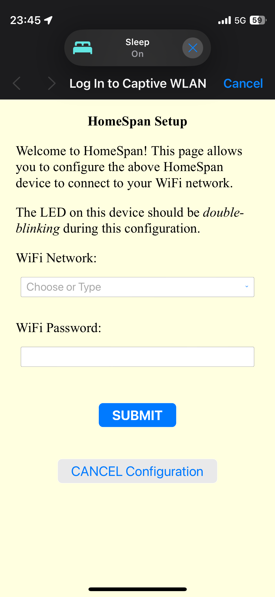
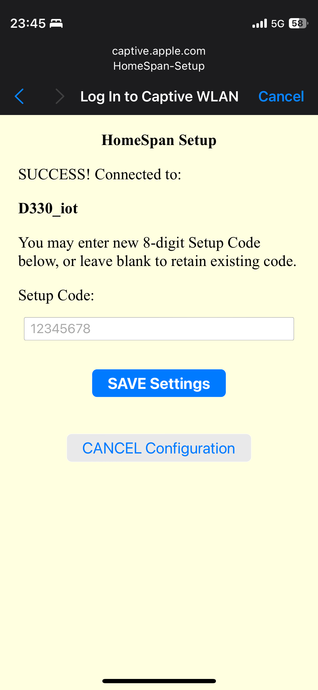
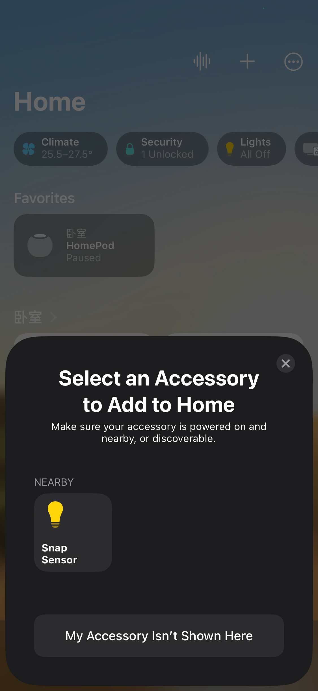
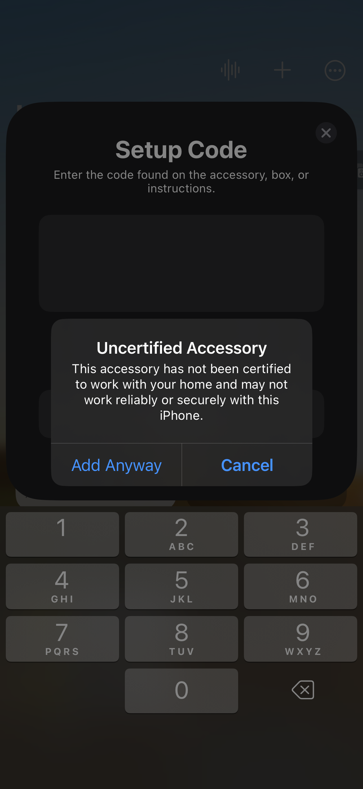
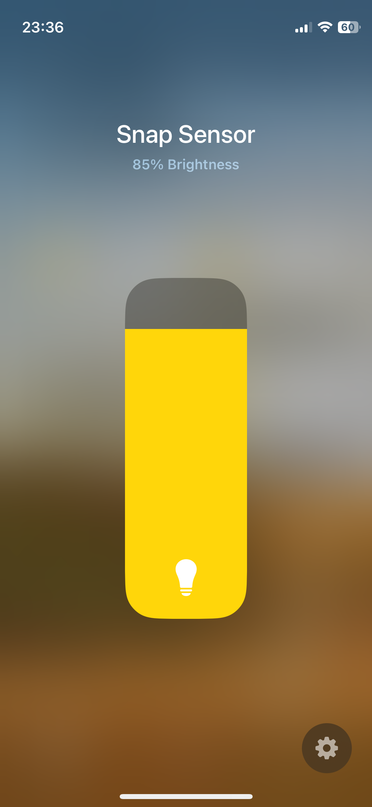

# Snap Sensor
[简体中文](./README_zh.md)

[How to Use](#direct-use)

[CollectData Mode](#CollectData-Mode)
## Introduction

This project uses the ```arduino``` framework. The current code occupies about 1.5-2M of memory, so ```PSRAM``` is temporarily required.

#### Performance of ESP32-S3 under the current audio feature and network structure:

Time consumption for each round of audio feature extraction: 160ms-180ms

```json
{
    "num_frames" : 7680,
    "num_mel_bins" : 40,
    "upper_frequency_limit" : 6000,
    "lower_frequency_limit" : 2000,
    "fft_shift_length" : 1024,
    "fft_step_length" : 256,
    "sample_rate" : 16000, 
    "threshold" : 0.9
}
```

Time consumption for each round of inference: about 90ms

```python
    def CNN(self):
        model = models.Sequential([
            layers.Input(shape=(FRAME_NUM,NUM_MEL_BINS),name='mel'),
            layers.Reshape((FRAME_NUM, NUM_MEL_BINS, 1)),
            layers.Conv2D(12, 3, activation='relu'),
            layers.MaxPooling2D(),
            layers.Dropout(0.3),
            layers.Flatten(),
            layers.Dense(32,activation='relu'),
            layers.Dropout(0.3),
            layers.Dense(1,activation='sigmoid')
        ])
        return model
```

> Parameter explanation:
>
> 1. In audio features
>
> num_frame refers to the number of frames of the audio, sample rate * time = number of frames
>
> num_mel_bin refers to the number of Mel spectrum buckets
>
> upper(lower)_frequency_limit refers to the frequency range received by the Mel matrix
>
> fft_shift_length refers to the length of each window during the short-time Fourier transform
>
> fft_step_length refers to the window step length during the short-time Fourier transform
>
> sample_rate and threshold should be understood literally
>
> 2. In the neural network
>
> FRAME_NUM refers to the number of frames of the short-time Fourier transform, the number of frames of the short-time Fourier transform = round up ( round up ( number of frames of the audio - window length ) / window step length + 1) 
>
> NUM_MEL_BINS refers to the number of Mel spectrum buckets

#### Required hardware

ESP32-s3 R8N16 ( `PSRAM` greater than 2M, `SPI ROM` should be greater than the model file size)

inmp441

## How to use

#### Direct use

1. Wiring, theoretically only need to connect the wires of inmp441, clock and data pins according to the wiring below, VCC connect to 3.3v, GND connect to GND, L\R connect to 3.3v

```
#define I2S_SD 12
#define I2S_SCK 11
#define I2S_WS 10
```

2. Use `platform io` or `arduino IDE` to install the required libraries

```
kosme/arduinoFFT@^2.0
nickjgniklu/ESP_TF@^1.0.0
homespan/HomeSpan@^1.9.0
```

3. Compile and burn

4. Package the model and model configuration and upload to the `SPI FS` of esp32

5. Connect to the wifi broadcast by ESP32 and set up the network

SSID: HomeSpan-Setup
Password: homespan
Follow the prompts to connect to your home Wi-Fi.

Set an 8-digit setup code that is not a sequence of numbers and does not repeat numbers.


6. Join `Homekit` or `Home Assistant`.

Ignore the unauthenticated device prompt and enter the setup code you previously set.



7. Set the threshold.
Due to Homekit limitations, use the brightness of the bulb to set the threshold, mapping 0-100 to 0-1.0.


#### CollectData Mode
Due to the small sample size of the dataset in the built-in model, and the fact that all recordings are made by myself, the performance might be subpar. The firmware compiled with the collectdata flag can return recorded data and predicted output to the server during runtime, which makes it convenient to collect and classify data for training your own model.

1. Modify main.cpp to change the corresponding address to the collection server's address
```C++
#define SERVER_IP IPAddress(192, 168, 1, 141)
#define SERVER_PORT 1234
```
2. Compile using the build flag in platformio.collect_data.ini

3. Upload to esp32

4. Use tools\collect.py for reception

5. Manually classify and retrain after classification

#### Train your own model

1. Clone the [snap detect](https://github.com/FUjr/snap_detect) repository

2. Adjust the network

3. Prepare the dataset and start training

You can contact me to get the dataset I annotated

#### Dataset preparation

To get as similar recording conditions as possible, it is recommended to use `inmp441` for collection

1. Move to the [esp websocket recorder](https://github.com/FUjr/esp_websocket_audio_recorder/) repository

2. Modify the wifi and password to your own, then visit the IP address of esp32, click play and then click record to start collecting samples

3. After the collection is finished, click stop to download automatically

4. Then use label-studio for annotation, note that each segment length should be similar to num_frames (the excess part will be cut and the insufficient part will be filled with 0 during the training of the snap detect repository)

The label interface of label studio is as follows, it is best to divide into snap, clap, other_noise, background_noise, etc., for dataset augmentation and weighting

```xml
<View>
  <Labels name="label" toName="audio" zoom="true" hotkey="ctrl+enter">
    
    
  <Label value="snap" background="#FFA39E"/><Label value="clap" background="#a9abf3"/><Label value="other_noise" background="#00ff40"/><Label value="background_noise" background="#dd9eff"/></Labels>
  <Audio name="audio" value="$audio" height="512" defaultscale="10"/>
</View>
```

5. Export json and use python script for slicing

```python
import json,os
import scipy.io.wavfile as wav
import numpy as np
from dataclasses import dataclass

RAW_AUDIO_PATH = "raw_audio"
CLASSIFIED_AUDIO_PATH = "classified_audio"

def get_newest_json():
    json_files = [i for i in os.listdir() if i.endswith(".json")]
    if not json_files:
        return None
    newest = json_files[0]
    for i in json_files:
        os.path.getctime(i)
        if os.path.getctime(i) > os.path.getctime(newest):
            newest = i
    return newest
LABLE_JSON = get_newest_json()

@dataclass
class Label:
    lable: str
    start: float
    end: float


class Classify:
    def __init__(self) -> None:
        self.lables = {}
        self.json_data = {}
        self.load_json()

    def load_json(self):
        with open(LABLE_JSON, "r") as f:
            self.json_data = json.load(f)

    def get_file_name(self,main_section):
        file_name = main_section['file_upload'].split("-")
        if len(file_name) > 2:
            file_name = ("-").join(file_name[1:])
        else:
            file_name = file_name[1]
        return f'{file_name}'
    
    def get_silce_info(self,result_section,file_name):
        for i in result_section:
            start = i['value']['start']
            end = i['value']['end']
            label = i['value']['labels'][0]
            if not self.lables.get(file_name):
                self.lables[file_name] = []
            label = Label(label,start,end)
            self.lables[file_name].append(label)

    def handle_section(self,section):
        file_name = self.get_file_name(section)
        self.get_silce_info(section['annotations'][0]['result'],file_name)
    
    def classify(self):
        for i in self.json_data:
            self.handle_section(i)

    def slice_audio(self):
        for file_name in self.lables:
            rate, data = wav.read(f'{RAW_AUDIO_PATH}/{file_name}')
            for label in self.lables[file_name]:
                if not os.path.exists(f'{CLASSIFIED_AUDIO_PATH}/{label.lable}'):
                    os.mkdir(f'{CLASSIFIED_AUDIO_PATH}/{label.lable}')
                wav.write(f'{CLASSIFIED_AUDIO_PATH}/{label.lable}/{file_name}-{label.start}.wav',rate,data[int(label.start * rate) :int(label.end * rate)])

    def count_each_lable(self):
        lables = {}
        for file_name in self.lables:
            print(file_name)
            for label in self.lables[file_name]:
                if not lables.get(label.lable):
                    lables[label.lable] = 0
                lables[label.lable] += 1
        print(lables)

classify = Classify()
classify.classify()
classify.count_each_lable()
classify.slice_audio()
```
