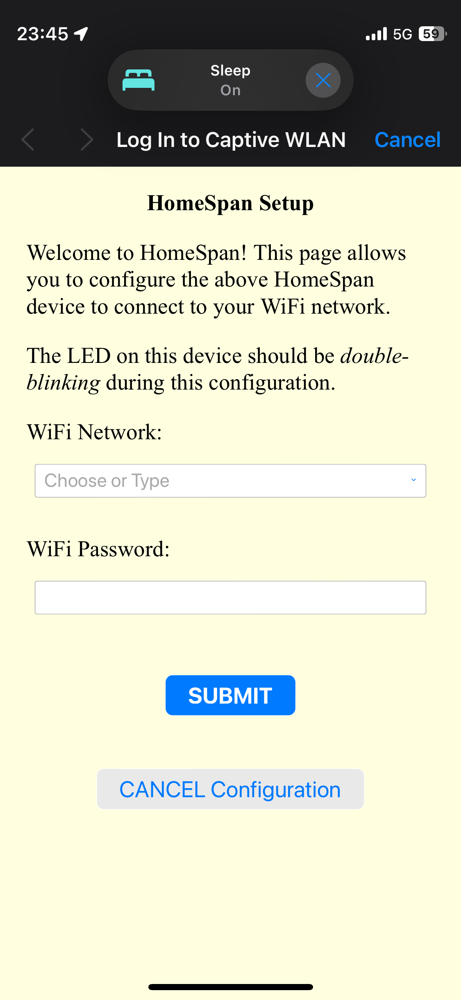
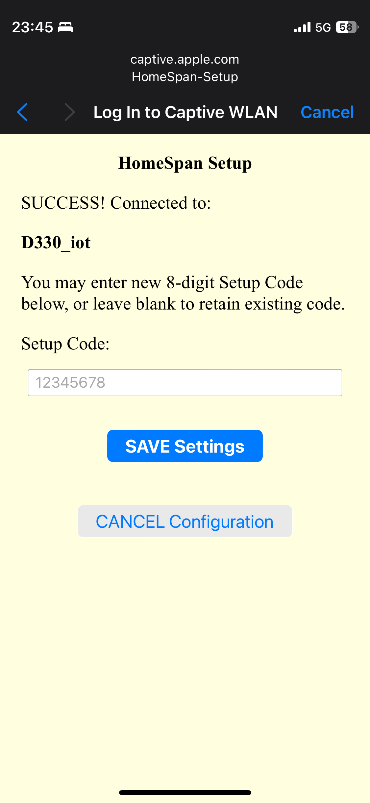
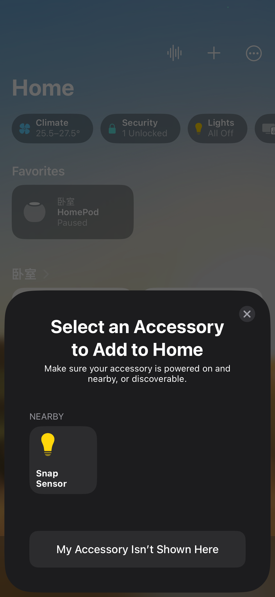

# 响指传感器

## 简介
[使用方法](#直接使用)
[高级使用](#CollectData模式)
本项目使用 ```aduino``` 框架，当前代码占用大约1.5-2M内存，因此```PSRAM```暂时是必须的

#### ESP32-S3 在当前音频特征和网络结构下的性能:

每轮音频特征提取耗时:160ms-180ms

```json
{
    "num_frames" : 7680,
    "num_mel_bins" : 40,
    "upper_frequency_limit" : 6000,
    "lower_frequency_limit" : 2000,
    "fft_shift_length" : 1024,
    "fft_step_length" : 256,
    "sample_rate" : 16000, 
    "threshold" : 0.9
}

```

每轮推理耗时: 约90ms

```python
    def CNN(self):
        model = models.Sequential([
            layers.Input(shape=(FRAME_NUM,NUM_MEL_BINS),name='mel'),
            layers.Reshape((FRAME_NUM, NUM_MEL_BINS, 1)),
            layers.Conv2D(12, 3, activation='relu'),
            layers.MaxPooling2D(),
            layers.Dropout(0.3),
            layers.Flatten(),
            layers.Dense(32,activation='relu'),
            layers.Dropout(0.3),
            layers.Dense(1,activation='sigmoid')
        ])
        return model
```

> 参数解释:
>
> 1、在音频特征中
>
> num_frame 指音频的帧数，采样率 * 时间 = 帧数
>
> num_mel_bin 指梅尔频谱桶的数量
>
> upper(lower)_frequency_limit 指梅尔矩阵接收的频率范围
>
> fft_shift_length 指进行短时傅里叶变换时，每段窗口的长度
>
> fft_step_length 指进行短时傅里叶变换时，窗口步长
>
> sample_rate 和 threshold 请按字面意思理解
>
> 2、在神经网络中
>
> FRAME_NUM 指的是短时傅里叶变换的帧数，短时傅里叶变换的帧数 = 向上取整( 向上取整 ( 音频的帧数 - 窗口长度 ) / 窗口步长 + 1) 
>
> NUM_MEL_BINS 指梅尔频谱桶的数量

#### 需要的硬件

ESP32-s3 R8N16 （ `PSRAM` 大于2M， `SPI ROM` 应当大于模型文件大小即可）

inmp441

## 使用方法

#### 直接使用

1、接线 理论上只需接inmp441的线 时钟和数据引脚按照下面接线，VCC 接3.3v GND 接GND ，L\R 接 3.3v

```
#define I2S_SD 12
#define I2S_SCK 11
#define I2S_WS 10
```


2、使用`platform io`或`arduino IDE`安装所需库

```
kosme/arduinoFFT@^2.0
nickjgniklu/ESP_TF@^1.0.0
homespan/HomeSpan@^1.9.0
```

3、编译并烧录

4、打包模型和模型配置并上传到esp32的`SPI FS`

5、连接ESP32发射的wifi，并进行配网
SSID: HomeSpan-Setup
密码 homespan
根据提示连接你家里的wifi

设置8位setup code，不能时连续数字、不能是重复数字


6、加入`Homekit` 或 `Home assistant`

忽略未经认证的设备提示，并输入之前设置的setup code


7、设置阈值
由于homekit限制，使用灯泡亮度来设置阈值，0-100映射为0-1.0


#### CollectData模式

由于自带模型的数据集样本量少、且都是我本人录制的，效果可能较差，以collctdata flag编译的固件可以在运行时像服务器回传录音数据和预测的输出，可以方便地采集和分类数据，用于自己模型的训练。

1、修改main.cpp 将对应地址改成采集服务器的地址
```C++
#define SERVER_IP IPAddress(192, 168, 1, 141)
#define SERVER_PORT 1234
```
2、使用platformio.collect_data.ini的build flag进行编译

3、上传到esp32

4、使用tools\collect.py进行接收

5、手动分类后重新训练


#### 训练自己的模型

1、克隆[snap detect](https://github.com/FUjr/snap_detect)仓库

2、调整网络

3、准备数据集开始训练

可联系我获得我标注的数据集


#### 数据集准备

为了获取尽可能相同的录音条件，建议使用 `inmp441` 进行采集

1、移步[esp websocket recorder](https://github.com/FUjr/esp_websocket_audio_recorder/)仓库

2、将wifi和密码修改为你自己的，再访问esp32的ip地址，点击play后点击record 就可以开始采集样本了

3、采集结束点击stop就会自动下载

4、然后使用label-studio进行标注,注意每段长度应当与num_frames差不多（snap detect仓库训练时多余部分会被截取、不足部分会补0）

label studio的label interface如下，最好分为snap、clap、other_noise、background_noise等，便于数据集增广和加权

```xml
<View>
  <Labels name="label" toName="audio" zoom="true" hotkey="ctrl+enter">
    
    
  <Label value="snap" background="#FFA39E"/><Label value="clap" background="#a9abf3"/><Label value="other_noise" background="#00ff40"/><Label value="background_noise" background="#dd9eff"/></Labels>
  <Audio name="audio" value="$audio" height="512" defaultscale="10"/>
</View>
```

5、导出json使用python脚本进行切割

```python
import json,os
import scipy.io.wavfile as wav
import numpy as np
from dataclasses import dataclass

RAW_AUDIO_PATH = "raw_audio"
CLASSIFIED_AUDIO_PATH = "classified_audio"

def get_newest_json():
    json_files = [i for i in os.listdir() if i.endswith(".json")]
    if not json_files:
        return None
    newest = json_files[0]
    for i in json_files:
        os.path.getctime(i)
        if os.path.getctime(i) > os.path.getctime(newest):
            newest = i
    return newest
LABLE_JSON = get_newest_json()

@dataclass
class Label:
    lable: str
    start: float
    end: float


class Classify:
    def __init__(self) -> None:
        self.lables = {}
        self.json_data = {}
        self.load_json()

    def load_json(self):
        with open(LABLE_JSON, "r") as f:
            self.json_data = json.load(f)

    def get_file_name(self,main_section):
        file_name = main_section['file_upload'].split("-")
        if len(file_name) > 2:
            file_name = ("-").join(file_name[1:])
        else:
            file_name = file_name[1]
        return f'{file_name}'
    
    def get_silce_info(self,result_section,file_name):
        for i in result_section:
            start = i['value']['start']
            end = i['value']['end']
            label = i['value']['labels'][0]
            if not self.lables.get(file_name):
                self.lables[file_name] = []
            label = Label(label,start,end)
            self.lables[file_name].append(label)

    def handle_section(self,section):
        file_name = self.get_file_name(section)
        self.get_silce_info(section['annotations'][0]['result'],file_name)
    
    def classify(self):
        for i in self.json_data:
            self.handle_section(i)

    def slice_audio(self):
        for file_name in self.lables:
            rate, data = wav.read(f'{RAW_AUDIO_PATH}/{file_name}')
            for label in self.lables[file_name]:
                if not os.path.exists(f'{CLASSIFIED_AUDIO_PATH}/{label.lable}'):
                    os.mkdir(f'{CLASSIFIED_AUDIO_PATH}/{label.lable}')
                wav.write(f'{CLASSIFIED_AUDIO_PATH}/{label.lable}/{file_name}-{label.start}.wav',rate,data[int(label.start * rate) :int(label.end * rate)])

    def count_each_lable(self):
        lables = {}
        for file_name in self.lables:
            print(file_name)
            for label in self.lables[file_name]:
                if not lables.get(label.lable):
                    lables[label.lable] = 0
                lables[label.lable] += 1
        print(lables)

classify = Classify()
classify.classify()
classify.count_each_lable()
classify.slice_audio()
```
